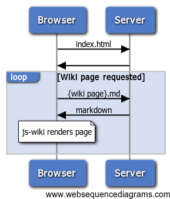

# Technical details

## Usage and installation

1. Put all your wiki files in a directory (files can be in subdirectories, you can nest away).
2. Configure your web server to serve up that directory.  You could stop here but those text files look ugly...
3. Download and extract the zip file into the directory.
4. [optional] Configure js-wiki e.g. first page to load, which file extension you use

## Configuration

There is no configuration file, just the single html file.  So if you want to override any of the defaults, you just pass different
options when you create the js-wiki browser object:

	var browser = new jswiki.browser(da, {
		"mrkdwn": new jswiki.parser.markdown
	});

## Design

The client side javascript makes AJAX requests for the markdown to display, then converts that to HTML and puts
it in the DOM.  There is a little bit of code required to correct relative links since the browser does not know
the path of the displayed wiki page, but that's about it; the javascript is around 150 lines long and really just
coordinates a few calls to the various libraries.

[Back to README][readme]

[readme]: README.md